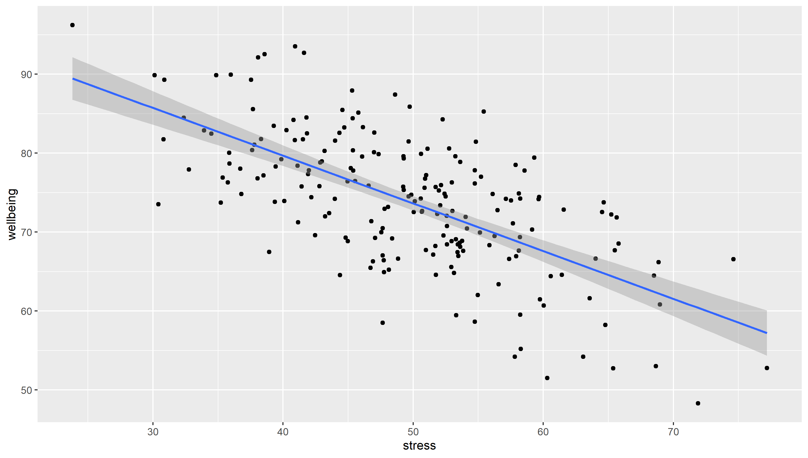
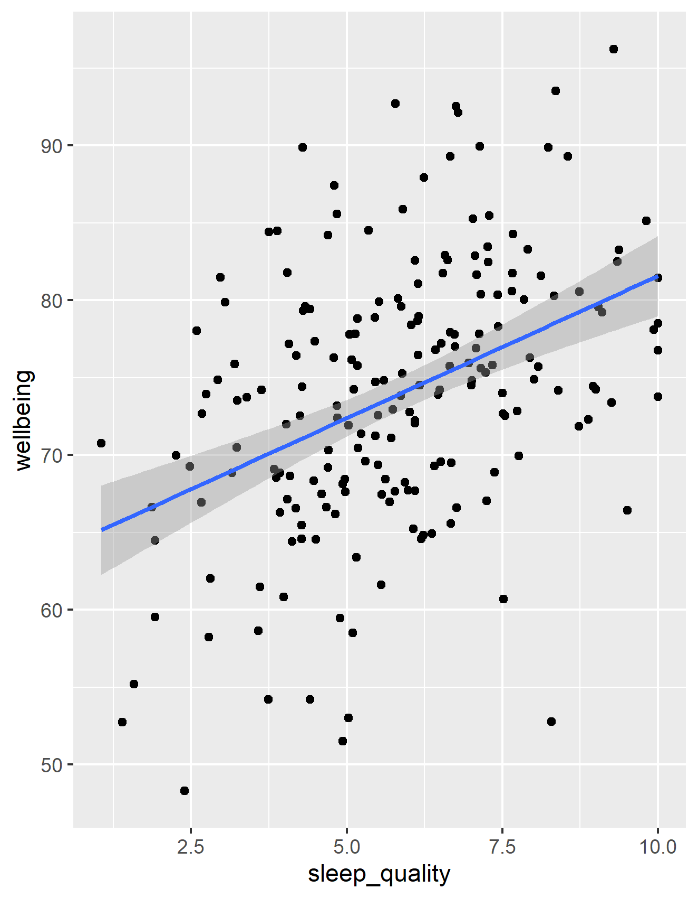
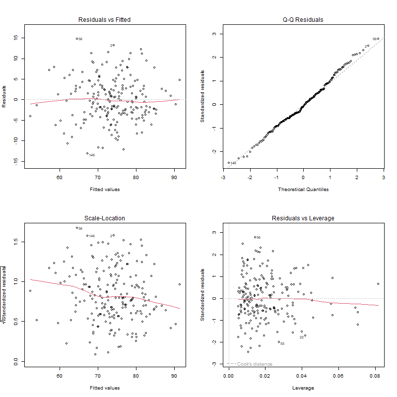

# Projekt

In diesem Projekt wird der Zusammenhang zwischen wahrgenommenem Stress, Schlaf (Dauer und Qualität) und subjektivem Wohlbefinden untersucht.
Ziel ist es, zentrale Zusammenhänge zu analysieren und zu prüfen, ob Stress ein signifikanter Prädiktor für das Wohlbefinden ist.
Der Datensatz wurde zu Übungszwecken durch ChatGPT simuliert. Die Analyse sowie Teile der Struktur und Formulierungen wurden mit Unterstützung von ChatGPT entwickelt.

Hintergrund dieser Arbeit ist es die Arbeitschritte zu einer Projekterstellung sowie den Umgang mit GITHub als Portfolio zu verstehen. 

## Methodisches Vorgehen

### Datenbereinigung
•	Prüfung auf fehlende Werte
•	Identifikation potenzieller Ausreißer mittels Boxplots
Es wurden keine fehlenden Werte gefunden. Einzelne Ausreißer lagen im erwartbaren Wertebereich und wurden nicht entfernt.

### Explorative Analyse
•	Deskriptive Statistiken (Übersicht der Variablen)
•	Korrelationsanalyse zwischen den Hauptvariablen

### Regressionsanalyse
Zur Untersuchung der Prädiktoren des Wohlbefindens wurde eine multiple lineare Regression durchgeführt.
Modell:
•	AV: Wohlbefinden
•	UVs: Stress, Schlafdauer, Schlafqualität

### Moderationsanalyse
Zusätzlich wurde geprüft, ob der Zusammenhang zwischen Stress und Wohlbefinden moderiert wird durch:
•	Geschlecht
•	Alter
Hierfür wurden Interaktionsterme in das Regressionsmodell aufgenommen.

## Ergebnisse:
### Korrelationen

Starker negativer Zusammenhang zwischen Stress und Wohlbefinden

Die Visualisierung zeigt einen deutlichen negativen Zusammenhang zwischen Stress und Wohlbefinden.

Moderater positiver Zusammenhang zwischen Schlafqualität und Wohlbefinden

Es zeigt sich ein positiver Zusammenhang zwischen Schlafqualität und Wohlbefinden.

•	Schwächerer positiver Zusammenhang zwischen Schlafdauer und Wohlbefinden

### Regression
•	Stress ist ein signifikanter negativer Prädiktor des Wohlbefindens
•	Schlafdauer und Schlafqualität sind signifikante positive Prädiktoren
•	Das Modell erklärt einen großen Anteil der Varianz (R² ≈ 0.62)

### Moderation
•	Keine signifikante Moderation durch Geschlecht
•	Keine signifikante Moderation durch Alter
→ Der Zusammenhang zwischen Stress und Wohlbefinden ist stabil über verschiedene Gruppen hinweg.

## Diagnostik
Die Modellannahmen wurden anhand grafischer Diagnostik überprüft.
Die Residuen zeigten eine weitgehend zufällige Verteilung ohne systematische Muster, was auf die Erfüllung der Linearitätsannahme hindeutet.
Der Q-Q-Plot deutete auf eine annähernde Normalverteilung der Residuen hin, mit lediglich geringen Abweichungen in den Randbereichen.
Hinweise auf Heteroskedastizität waren nur schwach ausgeprägt und wurden als unkritisch bewertet.
Zudem ergaben sich keine Hinweise auf stark einflussreiche Beobachtungen.

## Standardisierung
Zur besseren Vergleichbarkeit der Effekte wurden alle kontinuierlichen Variablen (Stress, Schlafdauer, Schlafqualität und Wohlbefinden) standardisiert (z-Transformation).

Dabei wurden die Variablen so transformiert, dass sie einen Mittelwert von 0 und eine Standardabweichung von 1 aufweisen. 
Durch die Standardisierung wird insbesondere der Vergleich der relativen Bedeutung der Prädiktoren innerhalb des Modells erleichtert.
Stress (β = -0.63) → stärkster Effekt
Schlafqualität (β = 0.34) → mittlerer Effekt
Schlafdauer (β = 0.30) → etwas schwächer

## Fazit
Die Ergebnisse zeigen, dass insbesondere Stress einen starken Einfluss auf das subjektive Wohlbefinden hat, während Schlaf – sowohl in Dauer als auch Qualität – einen positiven Beitrag leistet.
Die Zusammenhänge bleiben unabhängig von Alter und Geschlecht stabil, was auf robuste Effekte innerhalb des Datensatzes hindeutet.

## Limitationen
•	Simulierter Datensatz
•	Keine kausalen Schlussfolgerungen möglich
•	Keine Item-basierten Skalen (keine Reliabilitätsanalyse)

## Ausblick
Zukünftige Projekte könnten beinhalten:
•	Analyse von Item-Daten
•	Skalenkonstruktion und Reliabilitätsprüfung (z. B. Cronbach’s Alpha)
•	Faktorenanalysen (EFA / CFA)

## Verwendete Tools
•	R

